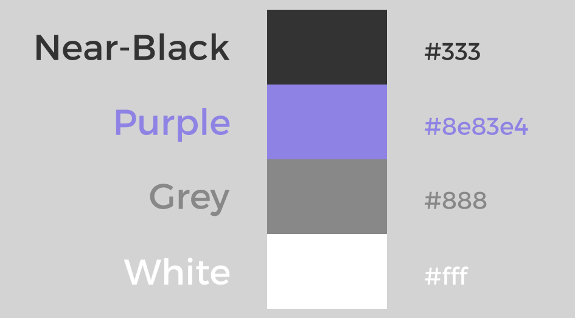

# DevConf Color Palette

|Name|Value|
|---|---|
|Solid Black|#000000|
|Near-Black|#333333|
|Mystic Purple|#8d83e8|
|Medium Grey|#888888|
|Brilliant White|#ffffff|

## Palette files

- [GIMP & Inkscape .GPL](DevConf.gpl)
  1. Copy to `~/.gimp-2.8/palettes/`

- [LibreOffice .SOC](DevConf.soc)
  1. Copy to `~/.config/libreoffice/4/user/config/`

- [Scribus .XML](DevConf.xml)
  1. `mkdir -p ~/.scribus/swatches/locked/`
  2. copy DevConf.xml to `~/.scribus/swatches/locked/`

- [Adobe .ASE](DevConf.ase)
